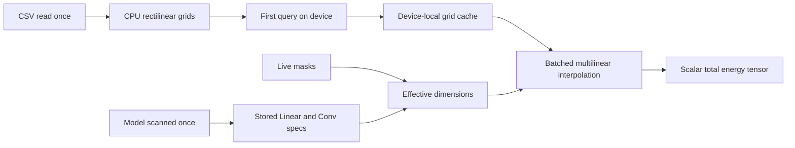

# Performance architecture

This document describes the performance work retained in the current API-only
JouleGrad implementation. These optimizations change how estimates are
prepared and evaluated; they do not change the interpolation equations or the
unit returned by the API, which remains millijoules per inference.

## Recommended training path

Construct the estimator and prepare the model once, after the model has been
placed on its training device:

```python
from joulegrad import EnergyEstimator

estimator = EnergyEstimator(
    "energy_lookup_table.csv",
    out_of_range="error",
)
prepared = estimator.prepare_model(
    model,
    input_shapes={"features.0": (batch_size, channels, height, width)},
    module_names=("features.0", "classifier"),
)

for batch in loader:
    current_masks = model.mask_probabilities()
    energy_mj = prepared(current_masks)
    loss = task_loss + energy_weight * energy_mj
```

Use `prepared.estimate(current_masks)` when a per-layer diagnostic report is
needed. Do not call `estimator.estimate_model(...)` inside the training loop:
that convenience method prepares and scans the model again on every call.

## Execution stages



The expensive structural work is performed during construction. The repeated
training path receives only current masks, derives scalar dimensions, performs
batched interpolation, and sums the result.

## 1. Lookup CSV parsed once

`EnergyEstimator(...)` reads the CSV once with pandas and validates:

- required `layer_type` and `energy_mean_mJ` columns;
- positive, non-missing energy values;
- required coordinates for each operator family; and
- unique measurement coordinates inside each grid.

It then creates `_PreparedGrid` objects containing PyTorch axes and value
tensors. Linear, Conv2d, Attention, and RotaryAttention rows are separated at
construction time. Conv2d grids are keyed by the discrete
`(kernel_size, stride, padding)` configuration.

Pandas is not used by layer queries after construction. The original dataframe
remains available as `estimator.data` for inspection, but the repeated path
uses prepared tensors.

### Complexity

If the CSV contains $N$ rows, parsing and grid construction are one-time
$O(N)$ preparation costs. Reusing one estimator avoids paying them per batch or
per layer.

## 2. Missing-grid work performed once

For the non-strict policies (`warn`, `clamp`, and `extrapolate`), incomplete
grids are filled during estimator construction rather than during every query.
Missing tensor cells are assigned the nearest measured value using Euclidean
distance in grid-index space.

This preprocessing uses `torch.cdist` and can be expensive for a very sparse,
large grid. It is nevertheless paid once. For final experiments,
`out_of_range="error"` avoids this approximation and retains the incomplete
grid so a query fails only when it needs a missing corner.

Unavailable Conv2d configurations are resolved lazily. The chosen nearest
configuration is cached in `_configuration_fallbacks`, so subsequent queries
for the same requested `(kernel_size, stride, padding)` do not repeat the
search.

These are approximation policies, not measurement recovery. Their scientific
semantics are documented in
[Out-of-range policy evolution](OUT_OF_RANGE_POLICIES.md).

## 3. Per-device grid cache

Prepared lookup grids begin on CPU. On the first query using coordinates on a
given device, JouleGrad moves the axes and values to that device and stores
them in `_device_grids` under:

```text
(resolved_grid_key, device_type, device_index)
```

Later queries reuse those tensors. A training loop therefore does not transfer
the full lookup grid from CPU to GPU every step.

The cache is per estimator instance. Creating a new `EnergyEstimator` inside a
batch loop defeats both CSV preparation and device caching.

## 4. Cached interpolation-corner patterns

A multilinear interpolation in $D$ dimensions evaluates $2^D$ cell corners.
The Boolean upper/lower corner pattern depends only on interpolation rank and
device, not on the coordinate values.

JouleGrad caches this pattern in `_CORNER_BITS` under:

```text
(rank, device_type, device_index)
```

For example, all trilinear Conv2d queries on one GPU reuse the same eight-corner
pattern. Corner indices and weights still depend on live coordinates and are
computed for every query.

## 5. Vectorized multilinear interpolation

`multilinear_interpolate_batch` accepts a coordinate matrix with shape:

$$
(P,D),
$$

where $P$ is the number of query points and $D$ is grid rank. It:

1. brackets every point along every dimension;
2. broadcasts lower/upper indices over all $2^D$ corners;
3. computes all corner weights as PyTorch tensors;
4. gathers all corner values in one advanced-indexing operation; and
5. reduces the weighted values to one result per point.

The scalar `multilinear_interpolate` API normalizes one point and delegates to
the same batched implementation. There is one interpolation algorithm rather
than separate scalar and vectorized code paths.

Discrete cell selection uses detached coordinates. Interpolation fractions use
live coordinates, preserving gradients inside a cell and under explicit
extrapolation.

## 6. Batched layer APIs

The estimator exposes both scalar and batched methods:

- `linear` and `linear_batch`;
- `conv2d` and `conv2d_batch`;
- `attention` and `attention_batch`.

Batched methods broadcast compatible coordinate columns and execute one
vectorized interpolation call. Callers estimating many compatible layers
should prefer them over Python loops around scalar methods.

## 7. Model scanned once

`estimator.prepare_model(...)` constructs a `ModelEnergyRegularizer`. During
construction it traverses `model.named_modules()` once and stores only compact
metadata for selected supported modules:

- name and input/output width for `nn.Linear`;
- name, channels, input shape, kernel, stride, and padding for `nn.Conv2d`.

The repeated `forward(masks)` path never traverses the model again. Conv2d
input shapes are explicit because runtime shape inference would require hooks
or an additional model execution and could infer the wrong topology for
branched networks.

For non-sequential or residual models, the generic scanner cannot infer shared
producer/consumer masks. The caller should define that topology explicitly in
its own application and call the estimator's layer APIs. This is an ownership
constraint, not a missing optimization.

## 8. Compatible operators grouped into batches

A prepared model evaluates:

- all selected Linear operators with one `linear_batch` call; and
- Conv2d operators with one `conv2d_batch` call per discrete
  `(kernel_size, stride, padding)` group.

Returned vectors are concatenated and summed with PyTorch operations. This
reduces Python dispatch and repeated interpolation setup when a model contains
many compatible layers.

When `skip_unsupported=True` and a grouped batch raises `ValueError`, the
regularizer retries operators individually so unsupported ones can be skipped.
That recovery path is intentionally slower and should not be the normal
training path. Validate supported modules during setup whenever possible.

## 9. Minimal forward path and optional diagnostics

The prepared object separates two APIs:

```python
energy_mj = prepared(masks)
details = prepared.estimate(masks)
```

Both evaluate the same energy equations. `forward` returns only the scalar
energy tensor needed by a loss. `estimate` additionally allocates a nested
Python dictionary with per-layer module types, effective dimensions, and
energies.

Use `forward` in the hot path and collect diagnostics at epoch boundaries or
during evaluation.

## 10. Device and dtype behavior

Tensor coordinates determine the query device. Scalar Python coordinates are
converted directly on that device using the estimator dtype, which defaults to
`torch.float64`. Coordinate columns are broadcast and stacked before batched
interpolation.

The value grid is also stored in the estimator dtype. Float64 reduces numerical
error in measured interpolation but can be slower than float32 on some devices.
Callers may construct `EnergyEstimator(..., dtype=torch.float32)` after checking
that the resulting precision is sufficient for their measurements and loss
scale.

Converting a live coordinate with `.to(device=..., dtype=...)` remains part of
the autograd graph. It does not detach mask-derived dimensions.

## 11. What was discarded during harmonization

The API-only refactor intentionally removed responsibilities that did not
belong in an interpolation library:

- command-line lookup queries;
- processed-summary parsing and lookup-table generation;
- bundled board measurement data;
- application-specific mask topology; and
- application-specific training or controller logic.

JouleQuest now owns summary acceptance and lookup generation. A consuming
application owns model topology and loss composition. JouleGrad only validates,
prepares, interpolates, batches, and reports estimates through Python APIs.

The following performance features were retained unchanged:

- one-time grid preparation;
- missing-grid preprocessing;
- per-device grid caching;
- nearest Conv configuration caching;
- cached corner patterns;
- scalar and batched vectorized interpolation;
- one-time model scanning;
- grouped layer evaluation; and
- diagnostics separated from the minimal loss path.

## 12. Practical checklist

For an efficient training integration:

1. Create one estimator per lookup and reuse it.
2. Place the model before calling `prepare_model`.
3. Select modules and supply Conv2d input shapes explicitly.
4. Prepare the model once outside the epoch loop.
5. Use `prepared(masks)` in each training step.
6. Use `prepared.estimate(masks)` only when details are required.
7. Prefer strict measured coverage; treat fallback preprocessing as setup-time
   approximation, not free data completion.
8. Profile with the target device and dtype before changing estimator precision.

No benchmark number is claimed here because speedup depends on model topology,
number of operator groups, grid rank, device, and batch size. The document
records implemented mechanisms and their expected cost reductions rather than
hardware-independent timing claims.
